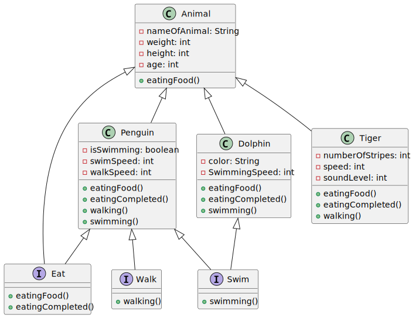

# Creating a zoo.
##  Project Overview.
Through the creation of this project, we explored the Java programming language.

We started with a base class named **Animal**, which served as a foundation for the common properties and functionalities shared among all animals.

Next, we focused on inheriting these common properties and functionalities using an abstract class. At this point, we created two animal classes: **Tiger** and **Dolphin**.

Following this, we introduced interfaces to extend the behavior of specific animals. We created a **Swim** interface to declare swimming functionality and a **Walk** interface for walking functionality. The Dolphin class implemented the Swim interface, while the Tiger class implemented the Walk interface.

Afterward, we utilized a menu system, implemented in the Main class, to display the details of the appropriate animal based on the user's request.

Subsequently, we added a new class, **Penguin**, which represented an animal capable of both walking and swimming. This was achieved by implementing multiple interfaces.

Finally, we tested the program's functionality to ensure everything worked as expected.

## Diagram of Classes using UML.

<div hidden>

```
@startuml README

abstract class Animal
interface Eat
interface Swim
interface Walk

class Animal{
-nameOfAnimal: String
-weight: int
-height: int
-age: int
+eatingFood()
}

class Dolphin{
-color: String
-SwimmingSpeed: int
+eatingFood()
+eatingCompleted()
+swimming()
}

class Penguin{
-isSwimming: boolean
-swimSpeed: int
-walkSpeed: int
+eatingFood()
+eatingCompleted()
+walking()
+swimming()
}

class Tiger{
-numberOfStripes: int
-speed: int
-soundLevel: int
+eatingFood()
+eatingCompleted()
+walking()
}

interface Eat{
+eatingFood()
+eatingCompleted()
}

interface Walk{
+walking()
}

interface Swim{
+swimming()
}


Animal <|-- Eat
Dolphin <|-- Swim
Penguin <|-- Eat
Penguin <|-- Swim
Penguin <|-- Walk

Animal <|-- Dolphin
Animal <|-- Penguin
Animal <|-- Tiger

@enduml
```

</div>



